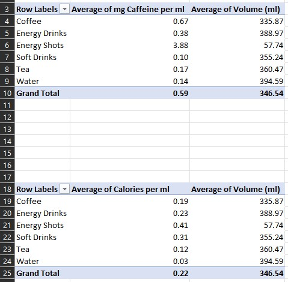
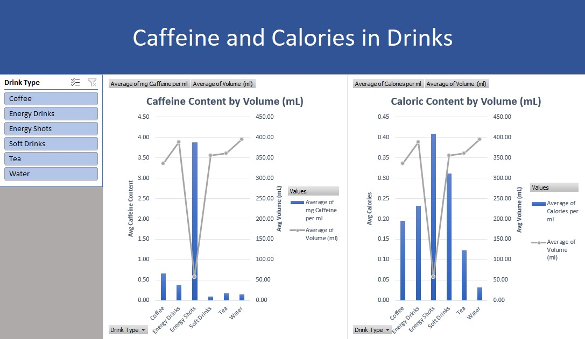

# Caffeine and Calories in Drinks Dashboard - Microsoft Excel

This analysis takes a dataset containing the caffeine and caloric content of 610 drinks including:
* Coffee
* Energy Drinks
* Energy Shots
* Soft Drinks
* Tea 
* Water

The average caffeine and caloric content of each drink type is compared to their average volume to illustrate the density of caffeine and calories in respect to each drink types' volumes.

Original dataset created by Heitor Nunes can be found here on Kaggle:
 - [Caffeine Content of Drinks](https://www.kaggle.com/datasets/heitornunes/caffeine-content-of-drinks)

## Data Cleaning
Minimal data cleaning was required; only renaming columns and creating new columns by using functions were necessary.
* Raw data copied over to a new worksheet in case any problems arise.
* Duplicates were checked for in the "Data" ribbon under "Data Tools" and no duplicates were to be found.
* Columns "drink" and "type" were renamed to "Drink Name" and "Drink Type"
* New column "Calories per ml" created by dividing the "Calories" column by the "Volume" column.
* New column "mg Caffeine per ml" created by dividing the "Caffeine (mg)" column by the "Volume" column.

## Analysis and Dashboard
After cleaning the dataset, pivot tables were used to find the average caffeine, calories, and volume of each drink type. From here, 2 charts can be created to compare the average caffeine content to the average volumes by drink type and the average caloric content to the average volumes.

## Acknowledgements
Project inspired by guided video project guide in Excel by Alex The Analyst.
 - [Alex The Analyst - "Full Project in Excel | Excel Tutorials for Beginners"](https://www.youtube.com/watch?v=opJgMj1IUrc)

